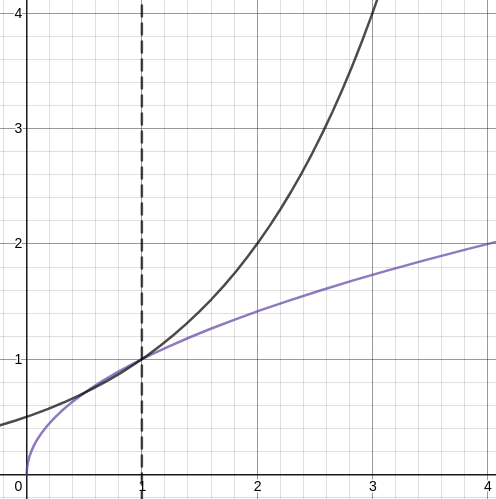
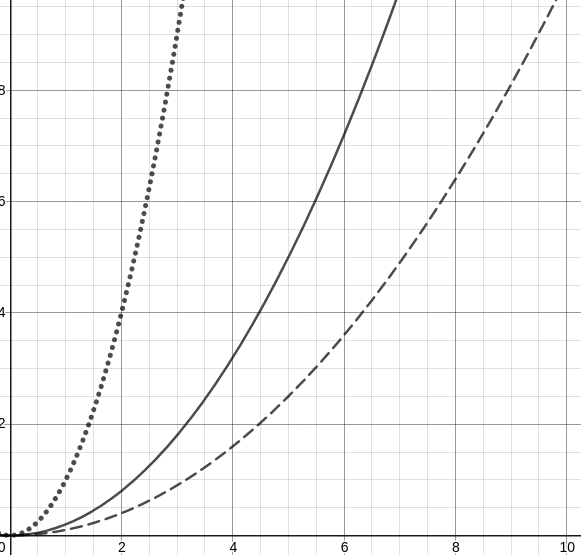

# Theta and Omega <!-- omit in toc -->

[~~Previous Chapter~~][prev] | [Next Chapter][next] | [Chapter Contents][index]

[prev]: ./index
[next]: ./02ram-model
[index]: ./index

- [Limitations of Big-O](#limitations-of-big-o)
- [Theta](#theta)
  - [Properties of Theta](#properties-of-theta)
    - [Mutual Asymptotic Growth](#mutual-asymptotic-growth)
      - [Proof 1](#proof-1)
    - [Mutual Asymptotic Bounds](#mutual-asymptotic-bounds)
      - [Proof 2](#proof-2)
- [Omega](#omega)
  - [Properties of Omega](#properties-of-omega)
    - [Inverse Big-O](#inverse-big-o)
      - [Proof 3](#proof-3)
- [All together](#all-together)
  - [Big-O of f](#big-o-of-f)
  - [Big Theta of f](#big-theta-of-f)
  - [Big Omega of f](#big-omega-of-f)

## Limitations of Big-O

With Big-O, it is possible to define the slowest possible runtime for an algorithm, but this could also mean that the algorithm could run faster than what $O(f(n))$ specifies.

For example:

$\text{An algorithm runs with }O(g(n))$

$\therefore \text{ there is some function and constant } f,c  \text{ such that }$

$0\leq f(n) \leq cg(n) \text{ for all n above a certain value.}$

What this means is that there a function in a set of functions denoted by $f(n)$ that is less than $g(n)$. This means that an algorithm that runs in $O(n^2)$ could also run in $O(\sqrt{n})$ or $O(\log n)$. It is not entirely clear.

## Theta

The definition of $\Theta(f(n))$ is as follows:

$\text{If }f(n) \in \Theta(g(n))\text{ then}$

$\exists c_1, c_2 \> 0: 0 \leq c_1 g(n) \leq f(n) \leq c_2 g(n)$

$\text{for all n greater than a certain value }$

In words, there is a function $g$ that asymptotically bounds (or "sandwiches") the function $f$ up to positive constants.

### Properties of Theta

#### Mutual Asymptotic Growth

The first property of $\Theta(f)$ is as follows:

$f\in\Theta(g) \iff f\in O(g) \wedge g \in O(f)$

In words: If there is a function $g$ that asymptotically bounds $f$, then $g$ grows asymptotically at least as fast as $f$ up to a constant, and also $f$ grows asymptotically at least as fast as $g$ up to a constant (and vice versa).

##### Proof 1

$\text{If }f\in\Theta(g)$

$\text{Then }0\leq c_1 g \leq f \leq c_2 g\text{ (given that }c_1, c_2 \> 0)$

$\therefore g\in O(f) \because f\leq c_2 g$

$\text{Also }\therefore f\in O(g) \because g\leq \frac{1}{c_1}f$

In words:

> If $f$ is sandwiched by $g$
>
> There is some positive integer constant $c_2$ such that $c_2 g$ is always greater than $f$ after a point.
>
> Additionally, there is some positive integer constant $c_1$ such that $\frac{1}{c_1} f$ is always greater than $g$ after a point.
>
> Therefore the functions grow asymptotically at least as fast as each other.

#### Mutual Asymptotic Bounds

The second property of $\Theta(f(n))$ is as follows:

$f\in\Theta(g) \iff g\in\Theta(f)$

In words: if $f$ asymptotically bounds $g$ up to constants, then $g$ asymptotically bounds $f$ up to constants (and vice versa).

##### Proof 2

$\text{If }f\in\Theta(g)$

$\text{Then }0\leq c_1 g \leq f \leq c_2 g\text{ (given that }c_1, c_2 \> 0)$

$\text{Note that }g \leq \frac{1}{c_1}f$

$\text{Also note that }g \geq \frac{1}{c_2}f$

$\therefore 0 \leq \frac{1}{c_2}f \leq g \leq \frac{1}{c_1}f$

$\text{Which is the definition for }g \in \Theta(f).$

This proof is a little easier to contextualise in words by reading the equations, so there is no text explanation here.

## Omega

The definition of $\Omega(f(n))$ is as follows:

$\text{If }f\in\Omega(g)$

$\text{Then }\exists c \> 1:0\leq g \leq cf$

$\text{for all n greater than a certain value }$

### Properties of Omega

#### Inverse Big-O

Omega is special in that it has the "opposite" definition to Big-O. This gives it the following property:

$f\in\Omega(g)\iff g \in O(f)$

##### Proof 3

$\text{If }f\in\Omega(g) \text{ then }\exists c_1: 0 \leq g \leq c_1f(n)$

$\text{Compare with }g\in O(f) \rightarrow \exists c_2: 0 \leq g \leq c_2f(n)$

$\text{Note that if }ac_1 = bc_2, \text{ where } a,b > 0\text{, the statement holds. }$

## All together

### Big-O of f

Representation of the set: $O(f)$

$O(f(n)) := \{ g(n) : \exists c,n_0\space cf(n) \leq g(n) \text{ where } n\geq n_0 \}$

In words: $O(f)$ is the set of **functions** where, when multiplied by a **positive integer factor**, are **asymptotically greater than** $f$ after some value $n_0$.

Example: $\sqrt{n} \in O(2^{n-1})$

### Big Theta of f

Representation of the set: $\Theta(f)$

$\Theta(f(n)) := \{ g(n): \exists(c_1,c_2,n_0) \space c_1 g(n) \leq f(n) \leq c_2 g(n) \}$

In words: $\Theta(f)$ is the set of **functions** where, when multiplied by **two positive integer factors** where one **strictly greater** than the other, provide asymptotes above and below the function $f$ after some value $n_0$.

Example: $x^2 \in \Theta(x^2)$

### Big Omega of f

Representation of the set: $\Omega(f)$

$\Omega(f(n)) := \{ g(n) : \exists c,n_0\space cg(n) \leq f(n) \text{ where } n\geq n_0 \}$

In words: $\Omega(f)$ is the set of **functions** that are **asymptotically less than** $f$ when it is multiplied by a **positive integer factor**.

Example: $2^{n-1} \in \Omega(\sqrt{n})$

