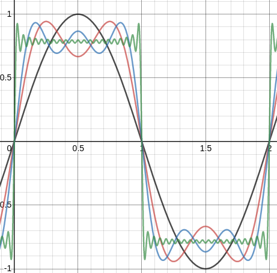
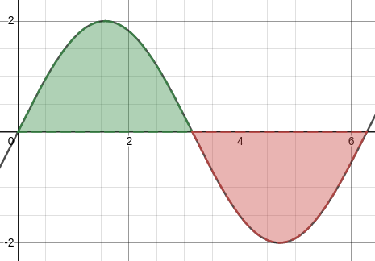

# Signals and representation <!-- omit in toc -->

[~~Previous Chapter~~][prev] | [~~Next Chapter~~][next] | [Chapter Contents][index]

[prev]: ./
[next]: ./
[index]: ./index

- [Sources](#sources)
- [Representation](#representation)
  - [Time domain](#time-domain)
  - [Frequency domain](#frequency-domain)
- [RMS and power](#rms-and-power)
  - [Instantaneous power](#instantaneous-power)
  - [Average value of AC signals](#average-value-of-ac-signals)
    - [Expressing instantaneous and average power](#expressing-instantaneous-and-average-power)
  - [Root mean square average (RMS)](#root-mean-square-average-rms)

## Sources

Sources can be represented by their **Norton** and **Thevenin** Equivalents:

> Note: these circuits are not equivalent, they are just an example representation of what Thevenin and Norton Equivalent circuits look like.

Thevenin is preferred when $R_s$ is low and Norton is preferred when $R_s$ is high.

Since sources are non-ideal in practice, these internal resistances are modelled by $R_s$. The amount by which the output voltage is decreased by means of a voltage divider.

In the above case, the voltage output can be calculated as $V_{out} = V_1 \frac{R_2}{R_2+R_s}$

In order to maximise the output of the non-ideal voltage source, the value of $R_2$ should be maximised so that $R_2 \gg R_s$

## Representation

Signals are either periodic (repeating) or aperiodic (non-repeating). Period signals can be summarised in the form of a standardised equation because they are predictable.

### Time domain

The time domain of a sinusoidal (sine wave) signal is a function of time that describes a signal's strength based on the following parameters.

$$
s(t)=A \sin (2\pi f t + \theta)
$$

$$
A = \text{amplitude, } f = \text{frequency, } t=\text{time, } \theta = \text{phase offset}
$$

Even aperiodic signals can be represented using the **sum of infinite sinusoidal signals of differing amplitude**.

The above image is a sum of sinusoidal signals that approximate a square wave.

### Frequency domain

The frequency domain of a signal shows that amplitudes of certain frequencies present within a signal.

Using the example above (square wave):

The first and largest peak is called the fundamental component, $f_0$, which is also equal to the frequency of the square wave that was approximated.

This shows that a square wave approximately contains (relative) frequency peaks $f_0$, $3f_0$, $5f_0$, $...$.

The transformation from the time domain to the frequency domain is called the **Fourier Transform**.

## RMS and power

### Instantaneous power

Power dissipated or absorbed by a circuit component at a given time can be given by:

$$
p(t)=v(t)\cdotp i(t)
$$

However since signals are periodic, it may be worth knowing the average power dissipation/absorption over the period of a signal.

> Note: in this unit, only **sinusoidal steady-state** signals are considered, so the current and voltage have the same frequency and hence the same period.

### Average value of AC signals

The average value across a time period of a signal can be given by finding the area under the curve and dividing by the time period:

$$
\bar{f} = \frac{1}{T} \int_{t_0}^{t_0+T}f(t)dt = \frac{1}{T} \int_{0}^{T}f(t)dt \text{ when } t_0 = 0
$$

However, the average of a sinusoidal wave across its time period is zero:

$$ \frac{1}{2\pi} \cdotp 2\cdotp (green - red) = 0$$

This means that the definition of average power must be re-formalised, as the above equation implies that power consumed/produced is zero.

#### Expressing instantaneous and average power

For sinusoidal voltage/current sources, it is known that:

$$
v(t) = V_{pk}cos(\omega t + \theta_V),\space i(t)=I_{pk}cos(\omega t + \theta_I)
$$

> Note: in this unit, we will assume that phases $\theta_V$ and $\theta_I$ are zero - i.e. only **resistive elements** will be considered.

For a resistor $R$, given that $I_{pk} = \frac{V_{pk}}{R}$, $i(t) = \frac{V_{pk}}{R}cos(\omega t)$

Therefore, the power dissipated by the resistor is given by:

$$
p(t)=v(t)i(t) = V_{pk}cos(\omega t) \frac{V_{pk}}{R}cos(\omega t)
$$

$$
p(t)=\frac{V_{pk}^2}{R}cos^2(\omega t)
$$

The average of this periodic function can also be found using the same method as above.

$$
\bar p(t)=\frac{1}{T}\int_{0}^{T} \frac{V_{pk}^2}{R}cos^2(\omega t) dt
$$

$$
\bar p(t)=\frac{1}{T}\frac{V_{pk}^2}{R} \frac{T}{2}
$$

$$
\bar p(t)=\frac{V_{pk}^2}{2R}
$$

### Root mean square average (RMS)

The root-mean-square (or RMS) of a periodic signal can be given by:

$$
s_{rms} = \sqrt{\frac{1}{T}\int_{0}^{T}s(t)^2dt}
$$

Voltage RMS:

$$
\begin{aligned}
v_{rms} &= \sqrt{\frac{1}{T}\int_{0}^{T} V_{pk}^2cos^2(\omega t) dt} \\
&= \sqrt{\frac{V_{pk}^2}{T}\frac{T}{2}} \\
&= \frac{V_{pk}}{\sqrt2} \\
\end{aligned}
$$

Current RMS:

$$
\begin{aligned}
i_{rms}
&= \sqrt{\frac{1}{T}\int_{0}^{T} \left(\frac{V_{pk}}{R} \right)^2 cos^2(\omega t) dt} \\
&= \sqrt{\frac{V_{pk}^2}{R^2T}\frac{T}{2}} \\
&= \frac{V_{pk}}{R\sqrt2} \\
&= \frac{I_{pk}}{\sqrt2} &\text{ (Using Ohm's Law) }
\end{aligned}
$$

RMS Power:

$$
\begin{aligned}
  p_{rms} &= v_{rms}i_{rms} \\
  & =\frac{V_{pk}}{\sqrt2}\frac{V_{pk}}{R\sqrt{2}} \\
  & =\frac{1}{2}\frac{V_{pk}^2}{R} \\
  & = \frac{1}{2}I_{pk}^2R &\text{ (Using Ohm's Law) }
\end{aligned}
$$
